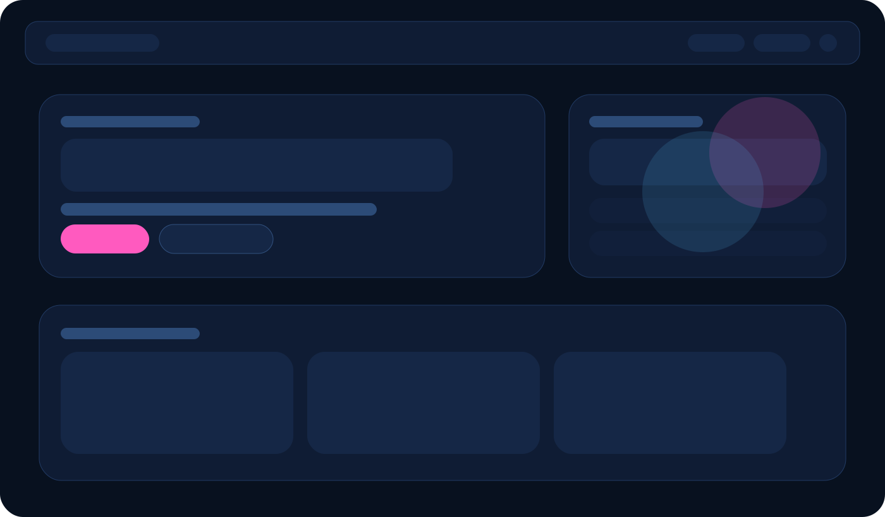
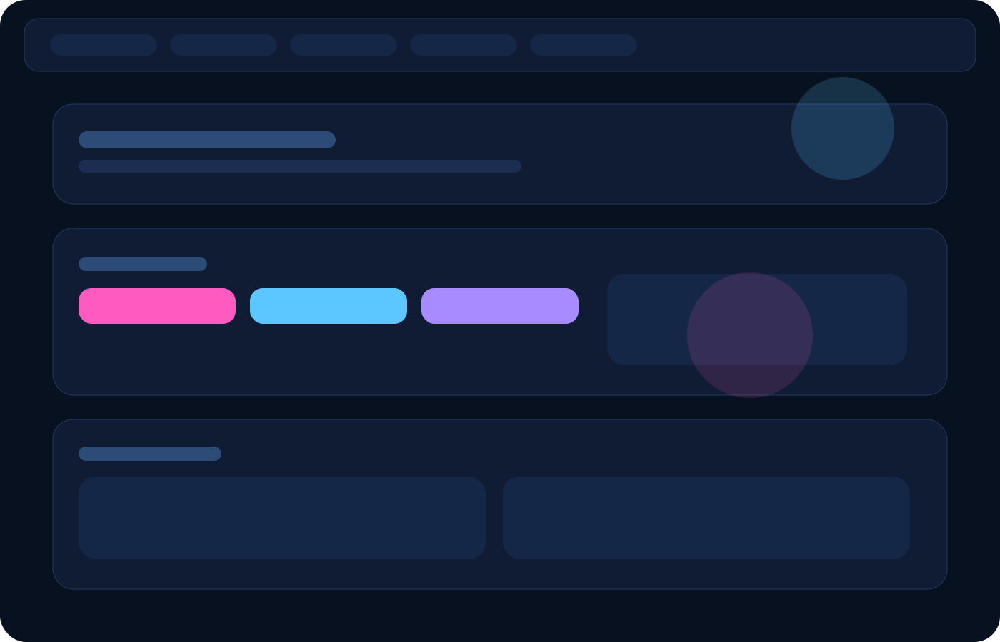

# MyPortafolio

MyPortafolio is a personal portfolio site for Shakiara Feliciano built with plain HTML, CSS, and JavaScript, now served through a lightweight Node server so the project can run with `npm`.

The repository includes:

- a main portfolio page
- a UI showcase page with interactive interface experiments
- a small Node server for local development and easy GitHub sharing
- a downloadable plain-text resume
- GitHub Pages deployment workflow

## What This Project Is For

This project is meant to showcase:

- personal branding and frontend presentation
- responsive layout and navigation
- reusable UI patterns
- interactive JavaScript with no framework
- a portfolio structure that is simple to run and maintain

## Main Pages

- `/`
  Main portfolio page
- `/ui-showcase`
  UI experiments and component showcase

## Live Deployment

Once GitHub Pages is enabled for this repository, the public URLs are:

- Portfolio: [https://shakiara.github.io/MyPortafolio/](https://shakiara.github.io/MyPortafolio/)
- UI Showcase: [https://shakiara.github.io/MyPortafolio/ui-showcase.html](https://shakiara.github.io/MyPortafolio/ui-showcase.html)

The repository now includes a GitHub Pages workflow to publish the site automatically from `main`.

## Screenshots

### Portfolio



### UI Showcase



## Tech Stack

- HTML
- CSS
- Vanilla JavaScript
- Node.js

## Project Structure

```text
MyPortafolio/
├── media/
│   Static media assets used by the project, including the downloadable resume and preview images.
├── pages/
│   ├── index.html
│   │   Main portfolio page.
│   └── ui-showcase.html
│       Secondary page with UI component demos and interaction experiments.
├── scripts/
│   ├── portafolio.js
│   │   Main frontend behavior for the portfolio:
│   │   project rendering, menu toggle, reveal animations, smooth scroll, and contact form behavior.
│   └── ui-showcase.js
│       Interaction logic for the UI showcase page.
├── styles/
│   ├── style.css
│   │   Main portfolio styling, layout, sections, cards, hero, contact, and responsive rules.
│   └── ui.css
│       UI showcase component styles and shared button styles used by the portfolio.
├── package.json
│   npm metadata and scripts.
├── package-lock.json
│   Lockfile for npm.
├── server.js
│   Lightweight Node HTTP server that serves the pages and static assets.
├── index.html
│   Redirect entry so the repo also works cleanly from GitHub Pages root.
├── ui-showcase.html
│   Redirect entry for the showcase route at the repository root.
└── README.md
    Project documentation and setup instructions.
```

## What Was Improved

This repository was updated to fix structural and functional issues:

- added `package.json` so `npm` works
- added `server.js` so the project can run locally with Node
- fixed the broken stylesheet path in `ui-showcase.html`
- refactored the main portfolio page structure
- improved the visual design of the home page
- cleaned up project data and links
- added a downloadable resume file
- added GitHub Pages deployment support
- added preview screenshots for the README
- updated the README to reflect the real repo

## How To Run Locally

### Option 1: Run with npm

From the project root:

```bash
cd "/Users/kyarah/Documents/MyPortafolio"
npm start
```

Then open:

[http://127.0.0.1:3000](http://127.0.0.1:3000)

### Development mode

If your Node version supports watch mode:

```bash
npm run dev
```

## Available npm Scripts

```bash
npm start
```

Starts the local Node server.

```bash
npm run dev
```

Starts the server in watch mode using Node.

## Routes

The local server supports:

- `/`
- `/ui-showcase`
- `/ui-showcase.html`
- `/api/health`

You can test health quickly with:

```bash
curl http://127.0.0.1:3000/api/health
```

## Design Notes

The current design direction is:

- dark editorial-style landing page
- stronger hero composition
- cleaner project cards
- clearer contact section
- more honest project framing without fake demo promises

## Resume Download

The project now includes a downloadable resume file:

- [Shakiara-Feliciano-Resume.txt](./media/Shakiara-Feliciano-Resume.txt)

## Known Scope

This is still a frontend portfolio, not a database-backed application.

There is no full backend for:

- storing contact form submissions
- user accounts
- admin dashboards
- databases

The Node server exists so the project can run cleanly through `npm`, serve routes reliably, and be easier to share.
<<<<<<< HEAD
=======

## If You Upload It To GitHub

Anyone who clones the repo can run it with:

```bash
git clone https://github.com/Shakiara/MyPortafolio.git
cd MyPortafolio
npm start
Then open:

http://127.0.0.1:3000

Suggested Next Improvements
replace the text resume with a polished PDF version
add more real projects with public live demos
capture real screenshots from the live site and replace the SVG preview cards
optionally migrate later to a small component-based stack such as Vite + React or Astro if the portfolio grows
## If You Upload It To GitHub

Anyone who clones the repo can run it with:

```bash
git clone https://github.com/Shakiara/MyPortafolio.git
cd MyPortafolio
npm start
```

Then open:

[http://127.0.0.1:3000](http://127.0.0.1:3000)

## Suggested Next Improvements

- replace the text resume with a polished PDF version
- add more real projects with public live demos
- capture real screenshots from the live site and replace the SVG preview cards
- optionally migrate later to a small component-based stack such as Vite + React or Astro if the portfolio grows
>>>>>>> 7bfbd58 (Update portfolio content, README, assets, and deployment setup)
